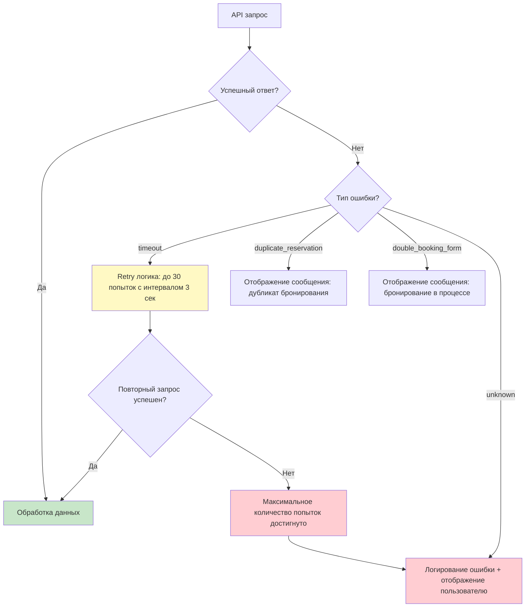

# Ostrovok API Integration Workflow Diagram

## Booking Flow (SERP → Hotelpage → Prebook → Form → Finish → Webhook)

```mermaid
graph TD
    A[Пользователь: Поиск отеля] --> B[API: searchByGeo / searchByHotelIds]
    B --> C{Ответ: status = 'ok'?}
    C -->|Да| D[Ответ: data.hotels[]]
    C -->|Нет| E[Ошибка: поиск]

    D --> F[Сохранение в БД через upsertHotel]
    F --> G[Отображение результатов на сайте]

    G --> H[Пользователь: Выбор отеля]
    H --> I[API: getHotelpage]
    I --> J{Ответ: status = 'ok'?}
    J -->|Да| K[Ответ: data.hotels[0].rates[]]
    J -->|Нет| L[Ошибка: hotelpage]

    K --> M[Отображение тарифов с налогами и условиями отмены]
    M --> N[Пользователь: Выбор тарифа]

    N --> O[API: prebook]
    O --> P{Ответ: book_hash получен?}
    P -->|Да| Q[Переход к форме бронирования]
    P -->|Нет| R[Ошибка: prebook]

    Q --> S[Пользователь: Заполнение формы]
    S --> T[API: createBookingProcess]
    T --> U{Ответ: booking_id получен?}
    U -->|Да| V[API: startBookingProcess]
    U -->|Нет| W[Ошибка: create booking]

    V --> X{Ответ: status = 'confirmed'?}
    X -->|Да| Y[Бронирование подтверждено]
    X -->|Нет| Z[Проверка статуса через checkBookingProcess]

    Z --> AA{Статус confirmed?}
    AA -->|Да| Y
    AA -->|Нет| AB[Пауза 3 сек → повторная проверка]

    AB --> Z

    Y --> AC[Webhook: POST /api/booking/webhook]
    AC --> AD{Статус из webhook?}
    AD -->|confirmed| AE[Обновление статуса в БД: confirmed]
    AD -->|failed| AF[Обновление статуса в БД: failed]
    AD -->|timeout| AG[Retry логика: повторная проверка]

    AE --> AH[Отправка уведомления пользователю]
    AF --> AH

    style A fill:#e1f5ff
    style Y fill:#c8e6c9
    style AE fill:#c8e6c9
    style E fill:#ffcdd2
    style L fill:#ffcdd2
    style R fill:#ffcdd2
    style W fill:#ffcdd2
```

## Error Handling Flow



## Data Flow: Hotel Information

```mermaid
graph LR
    A[Ostrovok API] --> B[searchByGeo / searchByHotelIds]
    B --> C[Ответ: data.hotels[]]
    C --> D[upsertHotel: сохранение в БД]
    D --> E[Таблица hotels в PostgreSQL]

    E --> F[getHotelpage]
    F --> G[Ответ: data.hotels[0].rates[]]
    G --> H[Отображение тарифов на сайте]

    H --> I[Пользователь выбирает тариф]
    I --> J[prebook]
    J --> K[book_hash]
    K --> L[createBookingProcess]
    L --> M[booking_id]
    M --> N[startBookingProcess]
    N --> O[Webhook обновление статуса]

    style A fill:#e1f5ff
    style E fill:#c8e6c9
    style O fill:#fff9c4
```

## Request/Response Flow Summary

| Step | Method | Endpoint | Request (snake_case) | Response Structure |
|------|--------|----------|---------------------|-------------------|
| 1 | POST | /b2b/v3/search/serp/geo/ | latitude, longitude, radius, checkin, checkout, guests, residency, language | { status: 'ok', data: { hotels: [] } } |
| 2 | POST | /b2b/v3/search/serp/hotels/ | hids, checkin, checkout, guests, residency, language | { status: 'ok', data: { hotels: [] } } |
| 3 | POST | /b2b/v3/search/hp/ | hid, checkin, checkout, guests, residency, language | { status: 'ok', data: { hotels: [{ rates: [] }] } } |
| 4 | POST | /b2b/v3/hotel/prebook | book_hash, price_increase_percent, language | { status: 'ok', data: { book_hash: '' } } |
| 5 | POST | /b2b/v3/hotel/order/booking/form/ | partner_order_id, book_hash, language, guests, ... | { status: 'ok', data: { booking_id: '' } } |
| 6 | POST | /b2b/v3/hotel/order/booking/finish/ | partner_order_id, language, ... | { status: 'confirmed' \| 'pending' } |
| 7 | POST | /b2b/v3/hotel/order/booking/finish/status/ | partner_order_id, language | { status: 'confirmed' \| 'pending' } |
| 8 | POST | /b2b/v3/hotel/order/cancel/ | partner_order_id, language | { status: 'ok' } |

## Critical Implementation Details

### 1. toSnakeCase Interceptor
```typescript
const toSnakeCase = (obj: any): any => {
  if (Array.isArray(obj)) return obj.map(toSnakeCase);
  if (obj !== null && typeof obj === 'object' && !(obj instanceof Date)) {
    return Object.keys(obj).reduce((acc, key) => {
      const snakeKey = key.replace(/([A-Z])/g, '_$1').toLowerCase();
      acc[snakeKey] = toSnakeCase(obj[key]);
      return acc;
    }, {} as any);
  }
  return obj;
};
```

### 2. Response Parsing
- **SERP**: `searchResult.data.hotels[]` (НЕ `data.result.hotels[]`)
- **Hotelpage**: `hotelpageResult.data.hotels[0].rates[]`
- **Error handling**: Проверка `result.error` на `timeout`, `unknown`, `duplicate_reservation`, `double_booking_form`

### 3. Geo Coordinates
```typescript
geo: h.latitude != null && h.longitude != null
  ? [Number(h.longitude), Number(h.latitude)] as [number, number]
  : null
```

### 4. Webhook IP Whitelist
- Dynamic loading from Cloudflare IPs: `https://www.cloudflare.com/ips-v4/` and `https://www.cloudflare.com/ips-v6/`
- Static Ostrovok ranges from certification email

### 5. Retry Logic
- Timeout: 30 attempts × 3 seconds = 90 seconds total
- Check `result.error` for retryable errors
- Exponential backoff optional
