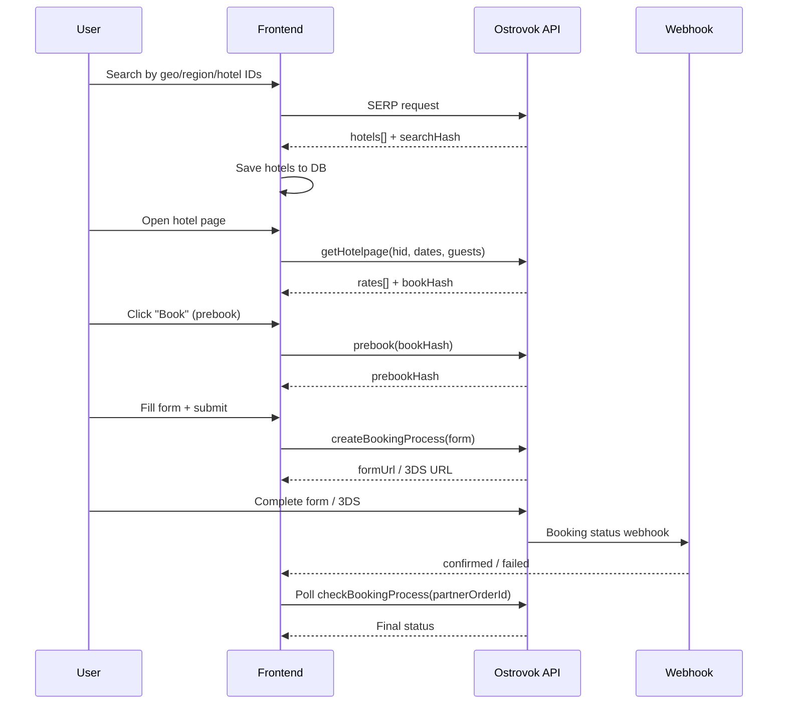

# Ostrovok API — Workflow Diagram

## Recommended booking flow

## Timeouts and retries

| Step | Timeout | Retries | Notes |
|------|---------|---------|-------|
| SERP | 30s | 2 | Fallback to local DB |
| Hotelpage | 30s | 2 | No cache (Ostrovok restriction) |
| Prebook | 60s | 2 | Required before form |
| Create booking | 60s | 10 | Retry on timeout/duplicate |
| Polling | 3s interval | 30 attempts | ~90s total |
| 3DS callback | 60s | 1 | Browser redirect |

## Retryable errors

- `timeout`
- `unknown`
- `duplicate_reservation`
- `double_booking_form`

## Non-retryable errors

- Validation errors
- Payment failures
- Missing required fields
